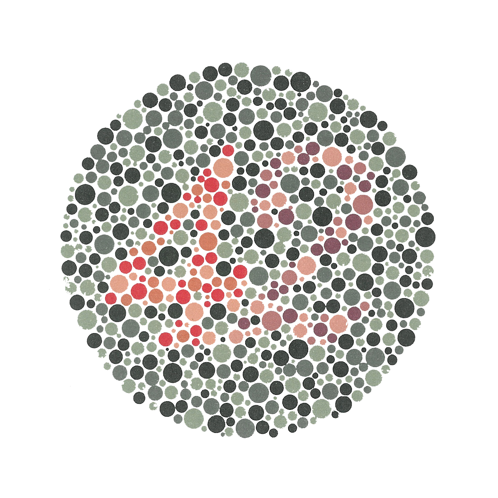

*   # Lessons from Making Millions of Websites More Accessible
    
    ### Aaron Jorbin [@aaronjorbin](http://twitter.com/aaronjorbin "follow me on twitter") [aaron.jorb.in](http://aaron.jorb.in "My homepage" )
 
*   # AddThis

*   # 14 Million Domains

*   # 1.3 Billion users every month

*   ## What is Accessability

    > [Accessibility supports social inclusion for people with disabilities as well as others, such as older people, people in rural areas, and people in developing countries.](http://www.w3.org/standards/webdesign/accessibility) 
    >
    > &ndash; W3C

    > [Web accessibility encompasses all disabilities that affect access to the Web, including visual, auditory, physical, speech, cognitive, and neurological disabilities.](http://www.w3.org/WAI/intro/accessibility.php) 
    >
    >&ndash; W3C

*   # Assistive Technology

*   

*   

*   

*   

*   

*   # Not All Problems can be solved with Assistive Technology

*   

*   <h1 class="sectionTitle"> Product Owners, Designers, Developers</h1>

*   # Product Owners

*   # Understand your reqsponsibilies

*   # Prioritizing Accessability has additonal Benifits

*   # SEO

*   # What can we as developers do?

*   # Use a screen reader

*   # Who should I follow on Twitter?

*   # What are the standards I should care about?

*   # 

*   # Tools

*   # [Chrome Extentions](http://code.google.com/p/google-axs-chrome/)
