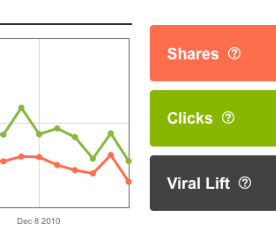
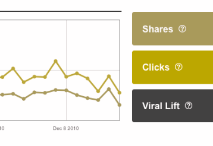
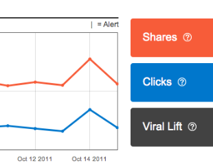
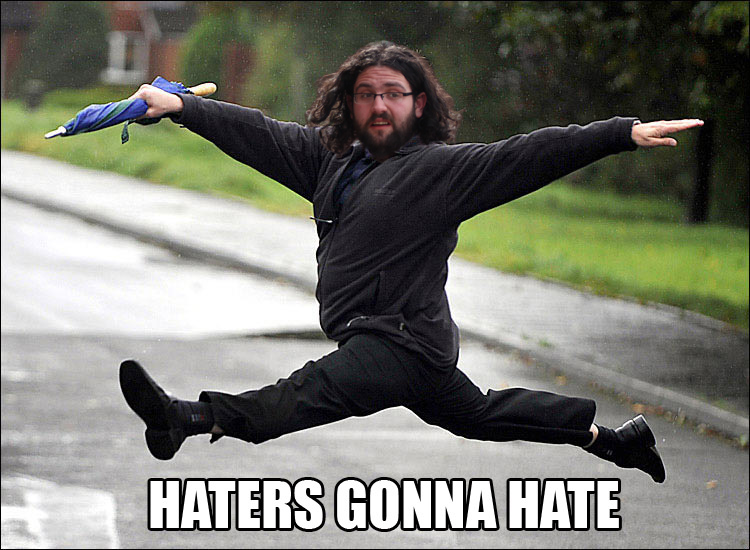

*   # Lessons from Making Millions of Websites More Accessible
    
    ### Aaron Jorbin [@aaronjorbin](http://twitter.com/aaronjorbin "follow me on twitter") [aaron.jorb.in](http://aaron.jorb.in "My homepage" )
 
*   # AddThis

*   # 14 Million Domains

*   # 1.3 Billion users every month

*   ## What is Accessibility

    > [Accessibility supports social inclusion for people with disabilities as well as others, such as older people, people in rural areas, and people in developing countries.](http://www.w3.org/standards/webdesign/accessibility) 
    >
    > &ndash; W3C

    > [Web accessibility encompasses all disabilities that affect access to the Web, including visual, auditory, physical, speech, cognitive, and neurological disabilities.](http://www.w3.org/WAI/intro/accessibility.php) 
    >
    >&ndash; W3C

*   ## What is one thing that you think every developer should know about Accessibility?

    > [It's often the decisions made before a line of code is written that impact accessibility the most](https://twitter.com/DavidAKennedy/status/209999350116528129)
    > &ndash; David Kennedy
    >
    > [Keyboard #a11y is a good sell. Power users don't like to use the mouse. Many AT users can't ](https://twitter.com/ewaccess/status/210033655085674496)
    > &ndash; Eric Wright

*   # Assistive Technology

*   

*   

*   <em>Jakob Vogel, from The Noun Project</em>

*   

*   # Not All Problems can be solved with assistive Technology

*   

*   <h1 class="sectionTitle"> Product Owners, Designers, Developers</h1>

*   # Product Owners

*   # Understand your responsibilities

*   # Prioritizing accessibility has additional benefits

*   # SEO

*   # Device Independence

*   # Inclusive Work Environment

<!-- END PRODUCT OWNERS SECTION  -->

*   # Designers

*   # Color Contrast 
    <em><a href='http://www.w3.org/TR/WCAG/#visual-audio-contrast'>(L1 + 0.05) / (L2 + 0.05), where L1 is the relative luminance of the lighter of the colors, and L2 is the relative luminance of the darker of the colors.</a></em>

*   # Click the Red Button

*   # Check your colors

*   

*   

*   

*   

*   # Caption your Videos

*   # Developers

*   # Use a screen reader

*   # What are the standards and Specs I should care about?

*   # HTML 
    <em><a href='http://dev.w3.org/html5/spec/single-page.html'>A vocabulary and associated APIs for HTML and XHTML</a></em>

*   # WAI-ARIA
    <em><a href='http://www.w3.org/WAI/intro/aria.php'>Accessible Rich Internet Applications</a></em>

*   # WCAG 2.0 
    <em><a href='http://www.w3.org/TR/WCAG/'>Web Content Accessibility Guidelines</a></em>

*   # ATAG 2.0 
    <em><a href='http://www.w3.org/TR/ATAG20/'>Authoring Tool Accessibility Guidelines</a></em>

*   # 508 
    <em><a href='http://www.section508.gov/'>Section 508 of the Rehabilitation Act</a></em>

*   ## Jorbin's Three laws
    
    > If it has hover style, it needs focus style
    >
    > If it's an anchor tag, it needs an href
    >
    > If the HTML isn't in the order that is logical and is how things get displayed, you'll want to shoot yourself making it accessible

*   # Decisions

*   # Accessibility starts with Usability

*   # Aim for an appropriate level of support
    <em>Some WCAG AAA requirements are ridiculous</em> 

*   # The Team Owns Accessibility 

*   # Include people with disabilities in your usability research
    <em><a href='http://www.uiaccess.com/accessucd/ut_plan.html#recruiting'>Recruiting Participants with Disabilities</a></em>

*   # Tools

*   # [Chrome Extensions](http://code.google.com/p/google-axs-chrome/)

*   # [Fire Eyes](http://www.deque.com/products/worldspace-fireeyes)

*   # [ColorDeBlind iOS app](http://itunes.apple.com/app/colordeblind/id513529073)

*   # [Sim Daltonism](http://michelf.com/projects/sim-daltonism/)

*   # [Contrast-A](http://www.adobe.com/cfusion/marketplace/index.cfm?event=marketplace.offering&offeringid=10763&marketplaceid=1)

*   # [Toucan color palettes](http://advanced.aviary.com/tools/color-swatches)

*   # [Keyboard-navigable JavaScript widgets](https://developer.mozilla.org/en/Accessibility/Keyboard-navigable_JavaScript_widgets)

*   # [WAI-ARIA Authoring Practices](http://www.w3.org/WAI/PF/aria-practices/) 

*   # [Creating Accessible Interactive Web Apps Using HTML5](http://google-axs-chrome.googlecode.com/svn/trunk/developer/io_2011/index.html)

*   # [Video Captioning on the Web](http://www.slideshare.net/kingkool68/video-captioning-on-the-web)

*   # [Able Gamers](http://www.ablegamers.org/)

*   # [Building An  Accessible Site from the ground up](http://www.slideshare.net/kingkool68/building-an-accessible-site-from-the-ground-up) 

*   # [WAI-ARIA Landmark Roles](http://juicystudio.com/article/examining-wai-aria-document-andmark-roles.php)

*   # [Mozilla Accessibility](http://www.mozilla.org/access/)

*   # [Accessibility Camp](http://www.accessibilitycamp.org/)

*   # [Accessibility is Not a Checklist](http://uxprinciples.com/?page_id=108)

<ul>
<li class="final"> <h1>Knowledge of human users and the social context in which systems are expected to operate become integrated into the computer science agenda, even at the earliest stages of research and development.</h1><em><a href="http://www.ifp.illinois.edu/nsfhcs/bog_reports/bog4.html"> Rob Kling and Susan Leigh Star</a>&nbsp;&ndash;&nbsp; Human Centered Systems in the Perspective of Organizational and Social Informatics</em>

<li class="final">   <h1>The power of the Web is in its universality. Access by everyone regardless of disability is an essential aspect.</h1><em><a href='http://www.w3.org/Press/IPO-announce'>Tim Tim Berners-Lee</a></em> 
</li>
</ul>

* <h2>Aaron Jorbin</h2>
